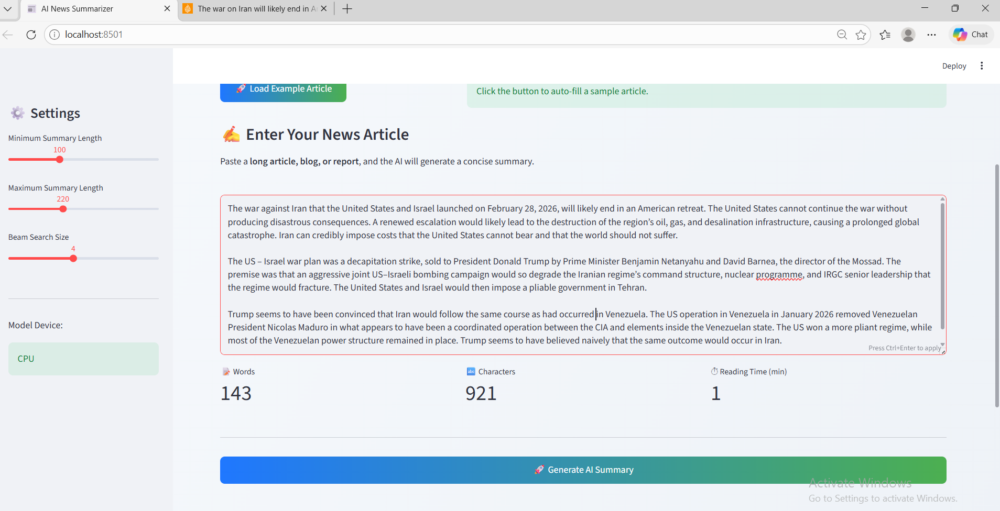
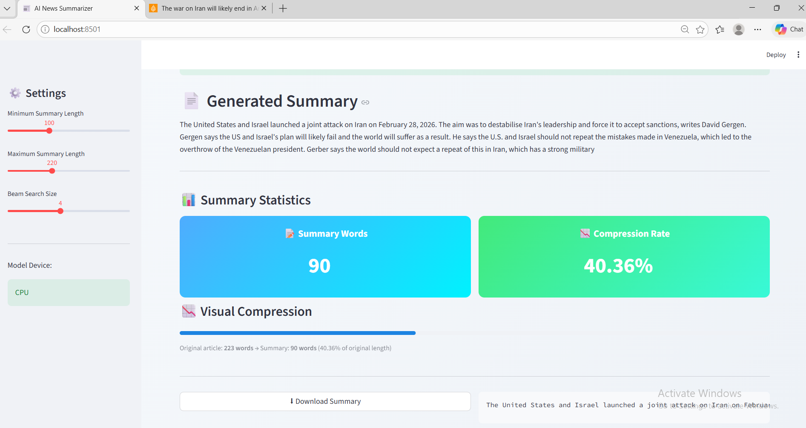

# 📰 AI-Powered News Article Summarizer using LoRA Fine-Tuning

## 📌 Problem Description

With the rapid growth of online news platforms, users are constantly overwhelmed by large volumes of lengthy news articles published every day. Reading full articles can be time-consuming, especially when users only need the most important information quickly.

This project aims to develop an AI-powered system capable of automatically generating concise and meaningful summaries from long news articles using advanced Natural Language Processing (NLP) techniques.

The system leverages Transformer-based deep learning models along with LoRA (Low-Rank Adaptation) fine-tuning to efficiently summarize lengthy news content while preserving important contextual information.

By converting long articles into short and informative summaries, the project helps users save time, improve information consumption, and quickly understand the key points of news reports.

---

## 🖼 System Demonstration

<table>
<tr>
<td>

<b>Input News Article</b>

</td>

<td>

<b>Generated Summary</b>

</td>
</tr>
</table>

---

## 📊 Dataset

For training and evaluating the summarization model, this project uses the **CNN/DailyMail** dataset available on 🤗 Hugging Face.

Dataset link: https://huggingface.co/datasets/cnn_dailymail
Original paper: https://arxiv.org/abs/1506.03340

The CNN/DailyMail dataset is one of the most widely used benchmarks for **abstractive text summarization** tasks. It contains news articles collected from CNN and Daily Mail websites, along with human-written summaries that highlight the key points of each article.

The dataset consists of approximately:

* **287,000 training samples**
* **13,000 validation samples**
* **11,000 test samples**

Each sample includes a news article and its corresponding summary.

### Dataset Structure

| id      | article                                                                                                                 | highlights                                                                |
| ------- | ----------------------------------------------------------------------------------------------------------------------- | ------------------------------------------------------------------------- |
| train_1 | The economy is showing signs of recovery after months of uncertainty. Analysts believe the market may stabilize soon... | Analysts say the economy may recover soon after months of uncertainty.    |
| train_2 | Scientists have discovered a new species of deep-sea fish living near hydrothermal vents in the Pacific Ocean...        | Researchers discover a new deep-sea fish species near hydrothermal vents. |
| ...     | ...                                                                                                                     | ...                                                                       |

* **article** → The full news article text
* **highlights** → The ground-truth summary written by humans

These article–summary pairs allow the model to learn how to generate concise summaries while preserving the most important information from long news articles.

